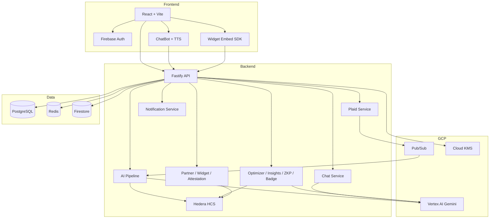

# Vivid — Financial Digital Twin

**Your financial identity, redefined. Beyond credit scores.**

---

## Table of Contents

- [The Problem](#the-problem)
- [Our Solution](#our-solution)
- [Key Features](#key-features)
- [Architecture](#architecture)
- [Tech Stack](#tech-stack)
- [Getting Started](#getting-started)
- [Demo Accounts](#demo-accounts)
- [API Reference](#api-reference)
- [Deployment](#deployment)
- [Contributing](#contributing)
- [License](#license)

---

## The Problem

- **FICO is 35 years old** and was not designed for gig workers, freelancers, or the underbanked.
- **45 million Americans are credit invisible** — no score or thin file.
- Traditional credit scores miss **income stability**, **spending behavior**, **resilience**, and **growth momentum**.
- Credit unions and community banks need a **trustworthy, multi-dimensional** view of applicants.

---

## Our Solution

**Vivid** builds a **Financial Digital Twin** — a living, AI-powered replica of a person's complete financial identity:

1. **Connect** bank account via Plaid (sandbox for demo).
2. **Analyze** up to 24 months of transactions with Vertex AI (Gemini 1.5 Pro).
3. **Score** across 5 dimensions: Income Stability, Spending Discipline, Debt Trajectory, Financial Resilience, Growth Momentum.
4. **Narrate** consumer-friendly and institution-ready summaries.
5. **Stamp** a profile hash on **Hedera Hashgraph** (HCS) for tamper-proof verification.
6. **Share** with lenders via permissioned links.

---

## Key Features

### Consumer Dashboard
- **5-dimension scores** (0–100) + overall weighted Vivid Score
- Radar chart with historical ghost overlay, timeline (income vs. spend), and spending breakdown donut chart
- Pillar explainability — per-dimension reasons and influential transactions
- Interactive narrative with clickable category drilldowns
- Blockchain verification badge (Hedera HCS)
- PDF export via browser print

### AI Financial Chatbot
- Floating chat assistant powered by **Vertex AI (Gemini 1.5 Pro)**
- Fully grounded in the user's live twin data (scores + narrative)
- **Dual voice TTS** — Nova (female, warm) or Atlas (male, analytical) via Web Speech API
- Auto-speak toggle; per-message read-aloud button
- Template-based fallback responses when AI is unavailable

### Spending Optimizer
- Identifies unnecessary recurring charges (subscriptions, fast food, discretionary)
- Monthly and annual savings estimates
- Cancel actions with direct URLs, email drafts, and phone numbers
- AI-generated summary of optimization opportunities

### Loan Shield
- Student and consumer loan risk analysis based on income and debt-to-income ratio
- Shield alerts ranked by severity (low → critical)
- Ready-to-sign documents: IDR applications, deferment requests, forbearance requests
- Documents stamped on Hedera for tamper-proof verification

### Red Flags Detection
- Identifies financial behaviors that hurt loan approval chances
- AI-powered analysis of transaction patterns for lender-facing risk signals
- Actionable guidance to address each red flag before applying

### Stress Testing
- Built-in scenarios: lose income, full job loss, medical emergency
- Custom scenarios: configure income reduction %, expense increase %, and one-time emergency expense
- Results: months of runway, adjusted dimension scores, financial breakdown comparison, AI narrative

### Anomaly Detection
- Detects lifestyle creep, subscription bloat, income volatility, spending spikes, savings decline
- Severity levels: info, warning, alert
- Financial health score banner
- AI-generated insights per anomaly

### Time Machine
- Future scenario projections — see where finances are headed in 6, 12, or 24 months
- Preset scenarios for common life events (raise, new job, baby, home purchase)
- AI-generated narrative comparing current trajectory vs. projected outcomes

### Bill Negotiation
- AI detects recurring bills eligible for negotiation (internet, phone, insurance, utilities)
- Generates ready-to-send negotiation emails tailored to each provider
- Iterative email refinement — adjust tone, add details, or change strategy
- Estimated annual savings per bill

### Financial Goals
- Create goals with custom targets, deadlines, and milestones
- Auto-progress tracking based on live twin data
- Goal statistics dashboard — completion rate, streaks, and trends
- Milestone management with individual progress tracking

### Peer Benchmarking
- Anonymous comparison against peers with similar demographics (age, income, employment type)
- See how each Vivid Score dimension stacks up against the cohort
- Privacy-preserving — no personal data is shared, only aggregate statistics

### Reputation Network
- Networked trust system with **attestations** from employers, landlords, and lenders
- Attestation providers register and submit signed attestations (income verification, rent history, employment status)
- Reputation graph visualization showing trust connections
- Composite reputation score combining twin scores with attestation signals
- Public attestation verification by hash
- Request attestations directly from providers

### Financial Identity Card
- Portable identity profile for credit-invisible consumers
- Combines twin scores, attestations, and demographic data into a single card
- Onboarding flow to complete profile for benchmarking and identity features

### Year-End Wrapped
- Spotify Wrapped–style annual financial summary
- Highlights: top spending categories, income growth, score improvements, biggest wins
- AI-generated year-in-review narrative

### Zero-Knowledge Proofs
- Create cryptographic claims (e.g., "Score above 70") without revealing raw data
- Set threshold, recipient, and expiry per claim
- Verify any proof by hash — public endpoint, no auth required
- Claims stamped on Hedera; revocable at any time

### Verified Badges
- Scoped consent badges for third-party access (overall score, score tier, dimension scores, lending readiness, blockchain verification)
- Embeddable via API endpoint, cURL, or HTML snippet
- Public badge verification endpoint
- Revocable; copy-to-clipboard share link

### Permissioned Sharing
- Generate UUID share tokens with granular permission toggles
- View count tracking per token
- Revoke any token instantly
- Public share view requires no authentication

### Embeddable Widget SDK
- Partners create widgets to embed Vivid scoring into their own apps
- Widget templates: Lending, Rental, Gig, Checkout, Generic
- Session-based consent flow — users authorize data sharing within the widget
- Widget analytics dashboard (sessions, conversions, scope usage)
- Token exchange for secure server-to-server data access

### Partner Dashboard
- Self-service partner registration with API key provisioning
- Partner tiers with usage limits
- Dashboard with API usage metrics and session analytics
- API key regeneration

### Continuous Plaid Sync
- Webhook-driven continuous transaction sync from Plaid
- Sync dashboard showing connection health, last sync time, and log history
- Manual sync trigger for on-demand refresh

### Notification Center
- In-app notifications for score changes, anomaly alerts, goal milestones, and attestation events
- Unread count badge in navigation
- Per-notification read and dismiss actions
- Notification preferences — toggle categories on/off

### Multi-Language Support
- Language selector for UI localization
- Supports multiple languages across the consumer experience

### Institution / Lender View
- Loan officer portal via share link (no account required to view)
- AI-generated lending narrative and product-level lending readiness (personal, auto, mortgage, small business)
- On-chain verification and compliance-friendly audit trail

---

## Architecture

**Security highlights:**
- Plaid tokens encrypted at rest (Cloud KMS in prod, AES-256-GCM in dev)
- Firebase ID token verified on all protected routes
- Partner API key authentication for widget and attestation endpoints
- No raw financial data on-chain — only SHA-256 profile hash
- Rate limiting, CORS, and Helmet on Fastify

---

## Tech Stack

| Layer | Technology |
|---|---|
| **Frontend** | React 18, TypeScript, Vite, Tailwind CSS, Zustand, TanStack Query, React Router, Recharts, Framer Motion, Firebase JS SDK, react-plaid-link, Web Speech API (TTS) |
| **Backend** | Node.js 20, Fastify v4, Prisma ORM, Zod, LangChain.js, `@google-cloud/vertexai`, `@hashgraph/sdk`, Plaid Node SDK, firebase-admin |
| **AI Pipeline** | Vertex AI (Gemini 1.5 Pro) — categorization, 5-pillar scoring, consumer & lender narratives, stress test, anomaly detection, optimizer, loan shield, red flags, time machine, bill negotiation, year-end wrapped |
| **Database** | PostgreSQL 15 (Cloud SQL), Redis 7 (caching), Firestore (real-time status) |
| **Blockchain** | Hedera Consensus Service (HCS) — profile hash, ZKP claims, loan documents, attestations |
| **Infra** | GCP: Cloud Run, Pub/Sub, Cloud KMS, Secret Manager, Cloud Storage; Firebase Hosting; Docker Compose (local dev) |

---

## API Reference

Base URL: `/api/v1`

### Auth

| Method | Path | Auth | Description |
|---|---|---|---|
| POST | `/auth/register` | — | Register with Firebase token + name |
| GET | `/auth/me` | Bearer | Current user |

### Plaid

| Method | Path | Auth | Description |
|---|---|---|---|
| GET | `/plaid/link-token` | Bearer | Get Plaid Link token |
| POST | `/plaid/exchange-token` | Bearer | Exchange public token, start twin generation (202) |

### Twin

| Method | Path | Auth | Description |
|---|---|---|---|
| GET | `/twin` | Bearer | Get current user's twin |
| POST | `/twin/regenerate` | Bearer | Regenerate twin |
| GET | `/twin/snapshots` | Bearer | Historical twin snapshots |
| GET | `/twin/categories` | Bearer | Spending aggregates by category |
| GET | `/twin/categories/:category` | Bearer | Transaction drilldown for a category |
| GET | `/twin/explain` | Bearer | Pillar explainability report |

### Optimizer

| Method | Path | Auth | Description |
|---|---|---|---|
| GET | `/optimize/subscriptions` | Bearer | Unnecessary charges and cancel actions |
| GET | `/optimize/loan-shield` | Bearer | Loan risk analysis and IDR/deferment documents |

### Insights

| Method | Path | Auth | Description |
|---|---|---|---|
| GET | `/insights/stress/scenarios` | — | Built-in stress test scenarios |
| POST | `/insights/stress` | Bearer | Run stress test simulation |
| GET | `/insights/anomalies` | Bearer | Anomaly detection report |

### Red Flags

| Method | Path | Auth | Description |
|---|---|---|---|
| GET | `/red-flags` | Bearer | Get red flags that hurt loan approval |

### Time Machine

| Method | Path | Auth | Description |
|---|---|---|---|
| GET | `/time-machine/presets` | — | Get simulation presets |
| POST | `/time-machine/simulate` | Bearer | Run future projection scenario |

### Bill Negotiation

| Method | Path | Auth | Description |
|---|---|---|---|
| GET | `/negotiate/bills` | Bearer | Detect negotiable bills |
| POST | `/negotiate/generate-email` | Bearer | Generate negotiation email |
| POST | `/negotiate/refine-email` | Bearer | Refine negotiation email content |

### Financial Goals

| Method | Path | Auth | Description |
|---|---|---|---|
| POST | `/goals` | Bearer | Create new goal |
| GET | `/goals` | Bearer | List user's goals |
| GET | `/goals/stats` | Bearer | Goal statistics |
| POST | `/goals/auto-progress` | Bearer | Auto-progress based on twin data |
| GET | `/goals/:goalId` | Bearer | Get specific goal |
| PATCH | `/goals/:goalId` | Bearer | Update goal |
| DELETE | `/goals/:goalId` | Bearer | Delete goal |

### Peer Benchmarking

| Method | Path | Auth | Description |
|---|---|---|---|
| GET | `/benchmark` | Bearer | Get peer benchmark data |

### Reputation & Attestations

| Method | Path | Auth | Description |
|---|---|---|---|
| POST | `/attestations/providers/register` | — | Register attestation provider |
| GET | `/attestations/providers` | — | List attestation providers |
| POST | `/attestations/submit` | API Key | Submit attestation |
| POST | `/attestations/revoke` | API Key | Revoke attestation |
| GET | `/attestations/me` | Bearer | Get user's attestations and reputation |
| GET | `/attestations/reputation` | Bearer | Get reputation score |
| GET | `/attestations/graph` | Bearer | Get reputation graph data |
| POST | `/attestations/request` | Bearer | Request attestation from provider |
| GET | `/attestations/verify/:hash` | — | Verify attestation (public) |

### Zero-Knowledge Proofs

| Method | Path | Auth | Description |
|---|---|---|---|
| GET | `/zkp/types` | — | Supported ZKP claim types |
| POST | `/zkp` | Bearer | Create a ZKP claim |
| GET | `/zkp` | Bearer | List user's ZKP claims |
| POST | `/zkp/:claimId/revoke` | Bearer | Revoke a ZKP claim |
| GET | `/zkp/verify/:proofHash` | — | Verify a ZKP claim (public) |

### Verified Badges

| Method | Path | Auth | Description |
|---|---|---|---|
| GET | `/verify/scopes` | — | Valid badge scopes |
| POST | `/verify` | Bearer | Create a verified badge |
| GET | `/verify` | Bearer | List user's badges |
| POST | `/verify/:badgeId/revoke` | Bearer | Revoke a badge |
| GET | `/verify/:consentToken` | — | Verify a badge (public) |

### Sharing

| Method | Path | Auth | Description |
|---|---|---|---|
| POST | `/share` | Bearer | Create share token |
| GET | `/share` | Bearer | List share tokens |
| POST | `/share/:tokenId/revoke` | Bearer | Revoke a share token |
| GET | `/share/access/:token` | — | Access twin by share token (public) |

### Chat

| Method | Path | Auth | Description |
|---|---|---|---|
| POST | `/chat` | Bearer | Send chat message; returns AI response grounded in twin |

### Institution

| Method | Path | Auth | Description |
|---|---|---|---|
| POST | `/institution/register` | — | Register institution |
| GET | `/institution/me` | Bearer (inst) | Get institution profile |
| GET | `/institution/applicant/:token` | Bearer (inst) | View applicant by share token |

### Embeddable Widgets

| Method | Path | Auth | Description |
|---|---|---|---|
| GET | `/widget/scopes` | — | Available widget scopes |
| GET | `/widget/:widgetId/config` | — | Get widget configuration |
| POST | `/widget/:widgetId/session` | — | Initiate widget session |
| POST | `/widget/consent` | Bearer | User consent for widget data |
| POST | `/widget/complete` | Bearer | Complete widget flow |
| POST | `/widget/deny` | Bearer | Deny widget consent |
| POST | `/widget/exchange` | API Key | Exchange session token for access |
| POST | `/widget/create` | Bearer | Create new widget |
| GET | `/widget/mine` | Bearer | List user's widgets |
| GET | `/widget/:widgetId/analytics` | Bearer | Widget analytics |

### Partner

| Method | Path | Auth | Description |
|---|---|---|---|
| GET | `/partners/tiers` | — | Get partner tier info |
| POST | `/partners/register` | Bearer | Register as partner |
| GET | `/partners/profile` | Bearer | Get partner profile |
| GET | `/partners/dashboard` | Bearer | Partner dashboard and metrics |
| POST | `/partners/regenerate-key` | Bearer | Regenerate API key |

### Sync

| Method | Path | Auth | Description |
|---|---|---|---|
| GET | `/sync/dashboard` | Bearer | Sync dashboard data |
| POST | `/sync/trigger` | Bearer | Trigger manual data sync |

### Identity

| Method | Path | Auth | Description |
|---|---|---|---|
| GET | `/identity/profile` | Bearer | Get identity profile |
| PATCH | `/identity/profile` | Bearer | Update identity profile |
| POST | `/identity/complete-onboarding` | Bearer | Complete onboarding |
| GET | `/identity/card` | Bearer | Get identity card data |

### Notifications

| Method | Path | Auth | Description |
|---|---|---|---|
| GET | `/notifications` | Bearer | List notifications |
| GET | `/notifications/unread-count` | Bearer | Get unread count |
| POST | `/notifications/read-all` | Bearer | Mark all as read |
| POST | `/notifications/:id/read` | Bearer | Mark notification as read |
| POST | `/notifications/:id/dismiss` | Bearer | Dismiss notification |
| GET | `/notifications/preferences` | Bearer | Get notification preferences |
| PATCH | `/notifications/preferences` | Bearer | Update notification preferences |

### Year-End Wrapped

| Method | Path | Auth | Description |
|---|---|---|---|
| GET | `/wrapped` | Bearer | Get year-end financial wrapped |

---

## Deployment

- **Backend**: Build Docker image from repo root, deploy to Cloud Run.
- **Frontend**: `npm run build -w frontend`, then `firebase deploy --only hosting`.
- **Local dev**: `docker compose up -d` to start PostgreSQL 15 and Redis 7.
- Set production env (Secret Manager, Cloud SQL, etc.) in Cloud Run and Firebase.

---

## Contributing

- Branch naming: `feature/...`, `fix/...`
- Commits: clear, conventional style
- PRs: link issue, pass lint and typecheck
- Code style: ESLint + Prettier (see `.eslintrc.json`, `.prettierrc`)

---

## Team

Manny Serrano and Kevin Benitez, Duke University '27

---

## License

Proprietary License — All Rights Reserved

